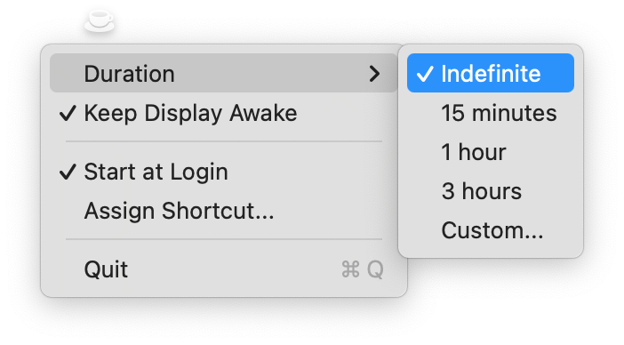

# CaffeineMate


A simple macOS menu bar app that keeps your Mac awake.

## Overview

CaffeineMate prevents your Mac from going to sleep using the same APIs as the built-in `caffeinate` command-line tool.

When active:

- Your system always stays awake (equivalent to `caffeinate -i`)
- Optionally keep your display awake too (equivalent to `caffeinate -i -d`)

## Features

- **One-click toggle** - Left-click the menu bar icon to activate/deactivate
- **Optional display awake** - Check "Keep Display Awake" to prevent screen from sleeping
- **Duration options** - Set a timer (15 min, 1 hour, 3 hours, custom, or indefinite)
- **Live countdown** - See remaining time in the menu bar
- **Global keyboard shortcut** - Toggle from anywhere
- **Launch at login** - Start automatically when you log in (macOS 13+)

## Installation

### Homebrew (Recommended)

```bash
brew install eddmann/tap/caffeinemate
```

### Manual Download

1. Download the latest release from [GitHub Releases](https://github.com/eddmann/CaffeineMate/releases)
2. Unzip and move `CaffeineMate.app` to your Applications folder
3. Double-click to open

The app is signed and notarized by Apple, so it will open without any security warnings.

## Usage



1. Click the coffee cup icon in your menu bar to activate/deactivate
2. **Right-click** to access settings:
   - Duration - Choose how long to stay awake (15 min, 1 hour, 3 hours, custom, or indefinite)
   - Keep Display Awake - Check this to also prevent your screen from sleeping
   - Assign Shortcut - Set a keyboard shortcut to toggle from anywhere
   - Start at Login - Launch automatically when you log in

### Menu Bar Icon

- Outline cup = inactive
- Filled cup = active
- Timer = shows countdown when using a duration (e.g., "15:30")

## Use Cases

- Downloads/uploads - Keep system awake while transferring large files
- Presentations - Enable "Keep Display Awake" so your screen doesn't dim
- Long tasks - Prevent sleep during builds, renders, or backups
- Reading - Keep display on while reading without touching the keyboard

## Requirements

- macOS 11.0 (Big Sur) or later

## Notes

To use keyboard shortcuts, grant Accessibility permissions when prompted.
